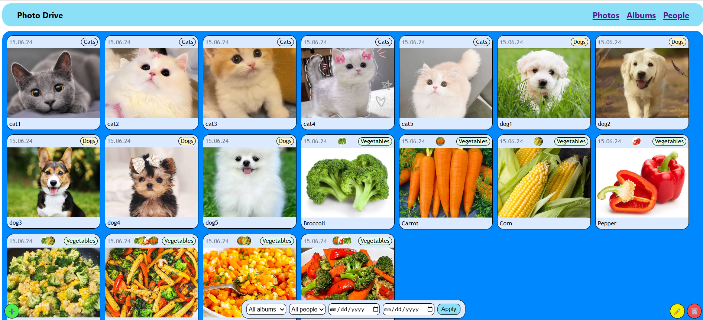
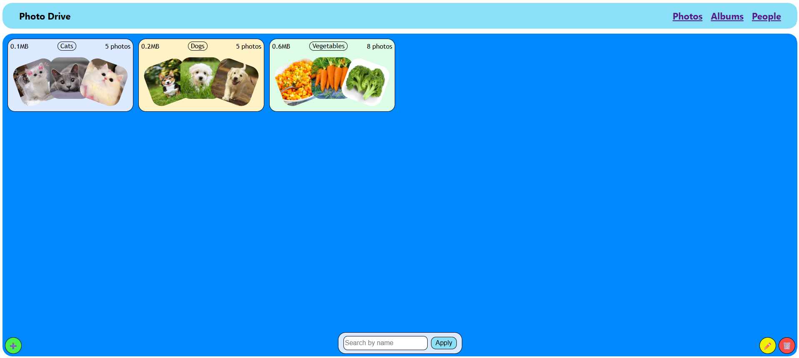
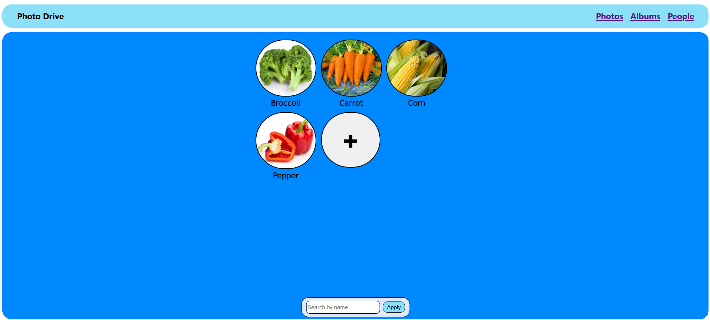
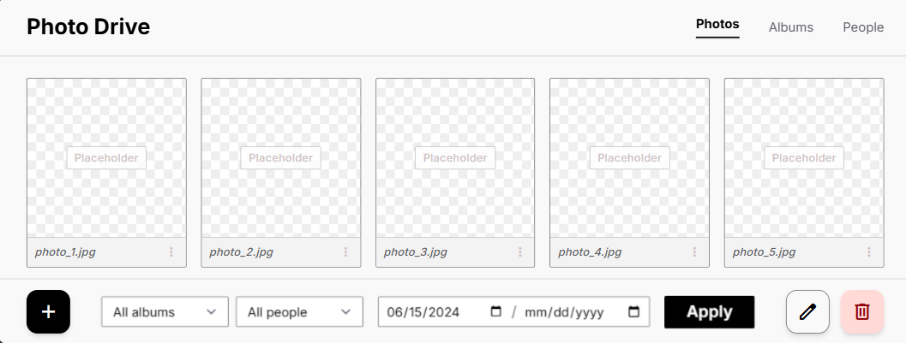
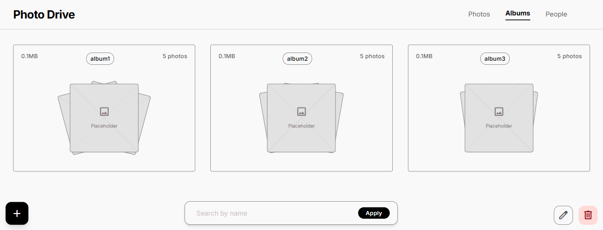
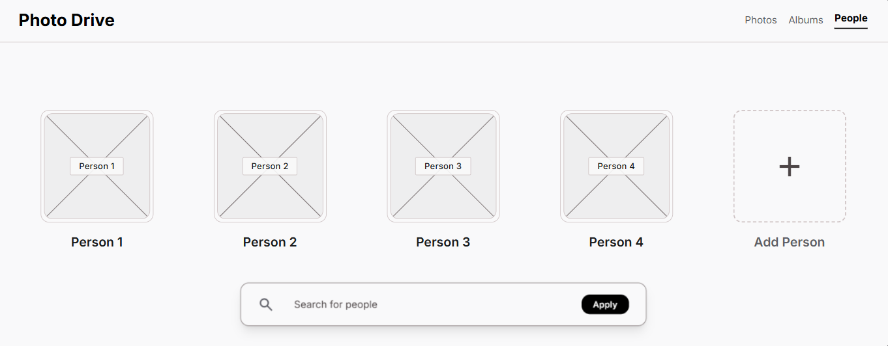
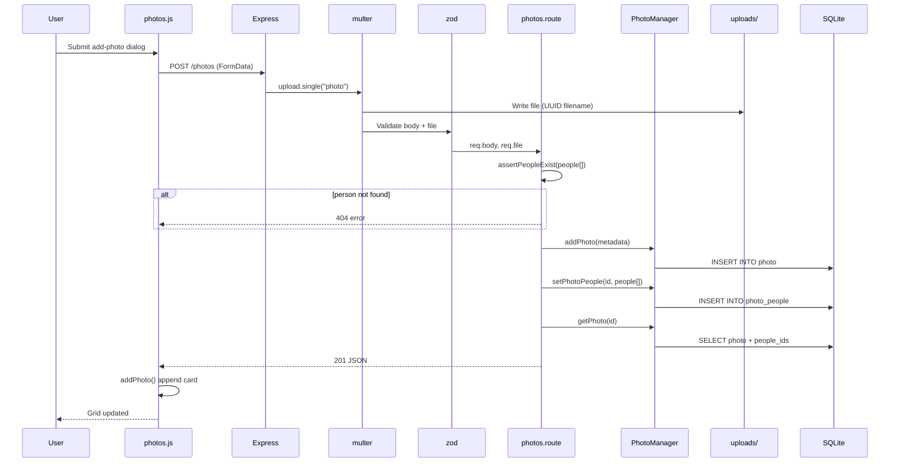
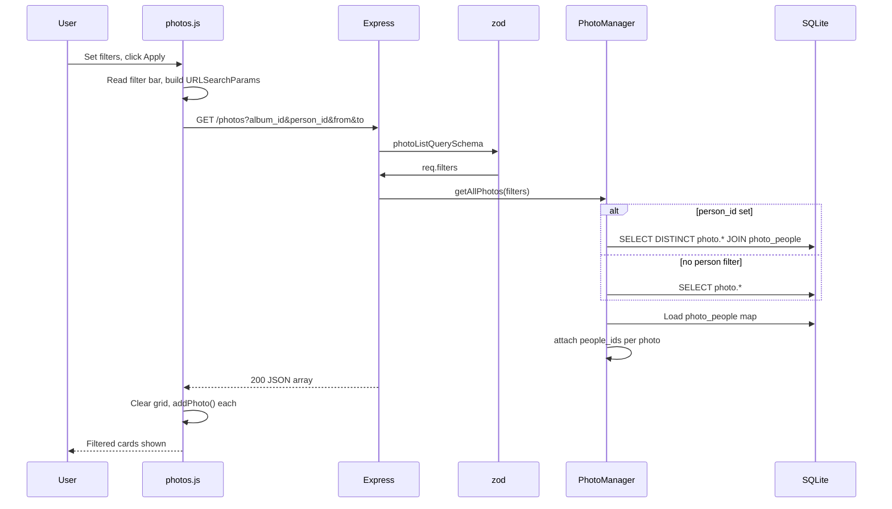

# Photo Drive Website
A personal <ins>**photo**</ins> organizer. The owner uploads photos, groups them into <ins>**albums**</ins> (e.g. Wedding, Honeymoon), and tags the <ins>**people**</ins> who appear in each photo (e.g. Mother, Sister). The app shows a list of photos, filterable by album or person, with summary stats (photo count, total size, date range) per album and per person.
<br>
<br>
Student: Andrew Kliusa (578848)




<br>
*Vegetables are used isntead of people for illustration purposes* 

> You can run the project by starting the server using `npm start` and opening any of the html files in the browser.

## Table of contents

- [Frontend](#frontend)
- [Backend](#backend)
- [Design Decisions](#design-decisions)
- [Project structure](#project-structure)
- [Wireframes](#wireframes)
- [Sequence diagrams](#sequence-diagrams)

Pages:
* [photos.html](../frontend/photos.html): List of all photos. Displays information about photo album, people in the photo and date of the photo. Filterable by album, person and date range.
* [albums.html](../frontend/albums.html): List of all albums. Displays information about the album and the photos in the album. Filterable by name.
* [people.html](../frontend/people.html): List of all people. Displays information about the person and the photos of the person. Filterable by name.

<br>*Note: To delete/edit `photo` or `album`, press corresponding button and click on a card you want to affect.*
<br>*Note: To delete/edit a `person` you need to hover over the person's avatar and click the corresponding button.*

### Frontend
Each page has its own html, css and js files. All three pages use the same [shared.css](../frontend/css/shared.css) and [shared.js](../frontend/scripts/shared.js) files.
HTML uses semantic elements and dialogs for taking input from the user. CSS uses flexbox/grid for layout and has proper units and media queries for responsiveness. JS loads information about photos, albums, people and displays it on the pages. It also caches the data for filtering and displaying current values in modals. It also handles clicks for every button and event listeners for every input field.

Codebase Navigation:
- HTML for navigation: [photos.html (14-21)](../frontend/photos.html#L14-L21)
- HTML for buttons/filters: [photos.html (25-42)](../frontend/photos.html#L25-L42)
- HTML for dialogs: [photos.html (43-92)](../frontend/photos.html#L43-L92)
- CSS for media queries: [shared.css (208-242)](../frontend/css/shared.css#L208-L242)
- CSS for album hover animation: [albums.css (5-37)](../frontend/css/albums.css#L5-L37)
- CSS for person buttons appearing on hover: [people.css (16-57)](../frontend/css/people.css#L16-L57)
- CSS for navigation/cards/buttons/layout: [shared.css (1-206)](../frontend/css/shared.css#L1-L206)
- JS for loading photos from server: [photos.js (120-195)](../frontend/scripts/photos.js#L120-195)
- JS for add/edit/delete photo: [photos.js (11-66)](../frontend/scripts/photos.js#L11-66)
- JS for adding photo to the grid: [photos.js (88-118)](../frontend/scripts/photos.js#L67-118)
- JS for filtering photos: [photos.js (120-149)](../frontend/scripts/photos.js#L130-174)

### Backend
Backend has database, middleware, routes, schemas and tests modules. Database has a single [setup file](../backend/database/database.js) that uses [`schema.sql`](../backend/database/database.sqlite) for defining tables and a [seeding script](../backend/database/seed.js). It also has [CRUD folder](../backend/database/crud/) with operations for each table and JSDoc typings. Middleware uses [multer](../backend/middleware/multer.js) for handling file uploads, and [zod](../backend/middleware/zod.js) for request validation, it also has a global [error handler](../backend/middleware/errorHandler.js).
Routes are in [routes folder](../backend/routes/) and have a single [server.js](../backend/server.js) with express setup. 
[Tests folder](../backend/tests/) contains unit and integration tests with some minimal testing that can be run using `npm test`. 
<br> Project uses multer to send/recive photo files and store them inside [uploads folder](../backend/uploads/). Files are stored with a random UUID as a name which in database is called `hash`. Files are also stored in the database as `photo` table row with `hash` being a reference to the file in the uploads folder.

Codebase Navigation:
- Database setup file: [database.js](../backend/database/database.js)
- Database schema: [schema.sql](../backend/database/schema.sql)
- Database seeding script: [seed.js](../backend/database/seed.js)
- Database CRUD operations: [album.js](../backend/database/crud/album.js), [person.js](../backend/database/crud/person.js), [photos.js](../backend/database/crud/photos.js)
- Middleware: [errorHandler.js](../backend/middleware/errorHandler.js), [multer.js](../backend/middleware/multer.js), [zod.js](../backend/middleware/zod.js)
- Routes: [photos.route.js](../backend/routes/photos.route.js), [albums.route.js](../backend/routes/albums.route.js), [people.route.js](../backend/routes/people.route.js)
- Tests: [setup.js](../backend/tests/setup.js), [integration tests](../backend/tests/integration/), [unit tests](../backend/tests/unit/)
- Express setup: [server.js](../backend/server.js)
- Photo storage folder: [uploads](../backend/uploads/)

### Design Decisions
- **Using request validation and testing** - Even though it was not required, this is something that genuinely makes the development process easier and prevents bugs. Changes made to the backend can be tested with a simple `npm test` command and request validation allowed easy global error handling.

- **Storing photos using middleware** - While it maybe an overkill for this project, it was not hard at all to implement, thanks to multer, which allowed to do this with just a few lines of code and brought real value to the project.

- **Frontend layout** - It was design to be simple and easy to implement with just grid and flexboxes. The real bliss of the design is a cute color palette and pretty hover animations that make the project look more professional and user-friendly.

- **Backend layout** - Follows a very basic structure that most contemporary projects use. Main target of this structure is to provide convinient code fragmentation and separation of concerns.

### Project structure
```
photo-drive/
├── backend/
│   ├── server.js                 # Express entry point
│   ├── vitest.config.js
│   ├── database/
│   │   ├── database.js           # SQLite connection and Database facade
│   │   ├── schema.sql            # Table definitions
│   │   ├── seed.js               # Demo data (Cats, Dogs, Vegetables albums)
│   │   ├── database.sqlite
│   │   └── crud/
│   │       ├── album.js
│   │       ├── person.js
│   │       └── photos.js
│   ├── middleware/
│   │   ├── errorHandler.js
│   │   ├── multer.js             # File upload handling
│   │   └── zod.js                # Request validation
│   ├── routes/
│   │   ├── albums.route.js
│   │   ├── people.route.js
│   │   └── photos.route.js
│   ├── schemas/
│   │   ├── album.schema.js
│   │   ├── common.js
│   │   ├── person.schema.js
│   │   └── photo.schema.js
│   ├── tests/
│   │   ├── setup.js
│   │   ├── integration/
│   │   │   ├── albums.test.js
│   │   │   ├── people.test.js
│   │   │   └── photos.test.js
│   │   └── unit/
│   │       ├── albums.test.js
│   │       ├── people.test.js
│   │       └── photos.test.js
│   └── uploads/                  # Stored photo files (seed images + user uploads)
│       ├── cat1.jpg … cat5.jpg
│       ├── dog1.jpg … dog5.jpg
│       ├── brocoli.jpg, carrot.jpg, corn.jpg, pepper.jpg, …
│       └── …                     # UUID-named files created on upload
├── frontend/
│   ├── photos.html
│   ├── albums.html
│   ├── people.html
│   ├── css/
│   │   ├── shared.css
│   │   ├── photos.css
│   │   ├── albums.css
│   │   └── people.css
│   ├── scripts/
│   │   ├── shared.js             # API helpers, navigation, seed trigger
│   │   ├── photos.js
│   │   ├── albums.js
│   │   └── people.js
│   └── resources/                # Static assets used by the frontend
│       ├── cat.png
│       └── cat_cropped.png
├── docs/
│   ├── README.md
│   ├── ERD.dbml
│   ├── ERD.png
│   ├── API-specification.docx
│   └── wireframes/
│       ├── photos.png
│       ├── albums.png
│       └── people.png
├── .env                          # Production environment config (uses sqlite db)
├── .env.test                     # Test environment config (uses in-memory sqlite db)
├── .gitignore
└── package.json
```

### Wireframes
**Photos**

<br>
**Albums**

<br>
**People**


### Sequence diagrams

#### 1. Upload photo with people tagged (`POST /photos`)



**Code trace** (each diagram step → implementation):

| Step | What happens | Code |
|------|----------------|------|
| 1 | User opens dialog and submits the add-photo form | [`photos.html` (43–66)](../frontend/photos.html#L43-L66), [`shared.js` (10–12)](../frontend/scripts/shared.js#L10-L12), [`photos.js` (11–13)](../frontend/scripts/photos.js#L11-L13) |
| 2 | Browser sends `POST /photos` as `FormData` | [`photos.js` (15–18)](../frontend/scripts/photos.js#L15-L18) |
| 3 | Express routes request to photo router | [`server.js` (17)](../backend/server.js#L17) |
| 4 | Multer handles the `photo` file field | [`photos.route.js` (28)](../backend/routes/photos.route.js#L28), [`multer.js` (5–11)](../backend/middleware/multer.js#L5-L11) |
| 5 | File saved to disk with UUID filename | [`multer.js` (6–9)](../backend/middleware/multer.js#L6-L9) → [`backend/uploads/`](../backend/uploads/) |
| 6 | Zod validates body + file metadata | [`zod.js` (3–6)](../backend/middleware/zod.js#L3-L6), [`photo.schema.js` (13–24)](../backend/schemas/photo.schema.js#L13-L24) |
| 7 | Route reads validated `people[]` from body | [`photos.route.js` (30)](../backend/routes/photos.route.js#L30) |
| 8 | Each tagged person is checked to exist | [`photos.route.js` (9–16, 32)](../backend/routes/photos.route.js#L9-L16) |
| 9 | **alt** - unknown person → 404 | [`photos.route.js` (11–12)](../backend/routes/photos.route.js#L11-L12), [`errorHandler.js`](../backend/middleware/errorHandler.js) |
| 10 | Photo metadata assembled from body + file | [`photos.route.js` (34–41)](../backend/routes/photos.route.js#L34-L41) |
| 11 | `INSERT INTO photo` | [`photos.route.js` (43)](../backend/routes/photos.route.js#L43), [`photos.js` CRUD (26–40)](../backend/database/crud/photos.js#L26-L40) |
| 12 | `INSERT INTO photo_people` for each tag | [`photos.route.js` (44)](../backend/routes/photos.route.js#L44), [`photos.js` CRUD (105–115)](../backend/database/crud/photos.js#L105-L115) |
| 13 | Full photo fetched with `people_ids` | [`photos.route.js` (45)](../backend/routes/photos.route.js#L45), [`photos.js` CRUD (96–102, 131–136)](../backend/database/crud/photos.js#L96-L102) |
| 14 | `201` JSON response returned | [`photos.route.js` (45)](../backend/routes/photos.route.js#L45) |
| 15 | Frontend parses response, renders card | [`photos.js` (21–25)](../frontend/scripts/photos.js#L21-L25), [`photos.js` `addPhoto` (88–118)](../frontend/scripts/photos.js#L88-L118) |
| 16 | Dialog closes, grid shows new photo | [`photos.js` (26)](../frontend/scripts/photos.js#L26) |

The browser sends one multipart request (`FormData`) containing the image and metadata. Multer stores the file under [`backend/uploads/`](../backend/uploads/) with a UUID `hash`. Zod validates fields and extensions/size. The route verifies each tagged person exists, inserts the photo row, then syncs the `photo_people` join table before returning the full photo object (including `people_ids`) for rendering.

#### 2. Filter photos with query parameters (`GET /photos`)



**Code trace** (each diagram step → implementation):

| Step | What happens | Code |
|------|----------------|------|
| 1 | User sets filters and clicks Apply (or page load calls `fetchPhotos` via `loadPhotos`) | [`photos.html` (25–34)](../frontend/photos.html#L25-L34), [`photos.js` (9)](../frontend/scripts/photos.js#L9), [`photos.js` `loadPhotos` (194)](../frontend/scripts/photos.js#L194) |
| 2 | Filter bar values read into `URLSearchParams` | [`photos.js` `fetchPhotos` (121–133)](../frontend/scripts/photos.js#L121-L133) |
| 3 | `GET /photos?album_id&person_id&from&to` sent | [`photos.js` (138–140)](../frontend/scripts/photos.js#L138-L140) |
| 4 | Express routes to photo list handler | [`server.js` (17)](../backend/server.js#L17), [`photos.route.js` (19)](../backend/routes/photos.route.js#L19) |
| 5 | Zod parses and validates query string | [`zod.js` (7)](../backend/middleware/zod.js#L7), [`photo.schema.js` (35–40)](../backend/schemas/photo.schema.js#L35-L40) |
| 6 | Parsed filters passed to CRUD as `req.filters` | [`photos.route.js` (21)](../backend/routes/photos.route.js#L21) |
| 7 | Dynamic SQL built from active filters | [`photos.js` CRUD `getAllPhotos` (56–80)](../backend/database/crud/photos.js#L56-L80) |
| 8 | **alt** - `person_id` set → `INNER JOIN photo_people` | [`photos.js` CRUD (61–64)](../backend/database/crud/photos.js#L61-L64) |
| 9 | **alt** - no person filter → `SELECT` from `photo` only | [`photos.js` CRUD (57)](../backend/database/crud/photos.js#L57) |
| 10 | Album / date filters add `WHERE` clauses | [`photos.js` CRUD (66–77)](../backend/database/crud/photos.js#L66-L77) |
| 11 | All `photo_people` rows loaded into a map | [`photos.js` CRUD (84, 118–128)](../backend/database/crud/photos.js#L118-L128) |
| 12 | Each photo extended with `people_ids` | [`photos.js` CRUD (86–88, 131–136)](../backend/database/crud/photos.js#L86-L88) |
| 13 | `200` JSON array returned | [`photos.route.js` (22)](../backend/routes/photos.route.js#L22) |
| 14 | Frontend parses response, clears cache and grid | [`photos.js` (143–145, 135–136)](../frontend/scripts/photos.js#L135-L136) |
| 15 | Each photo rendered via `addPhoto()` | [`photos.js` (147–148, 88–118)](../frontend/scripts/photos.js#L147-L148) |

Filtering is triggered only by clicking the "Apply" button. The frontend turns filter bar values into query params. Zod coerces and validates them server side. When filtering by person, SQL adds an `INNER JOIN` on `photo_people`, album and date filters add `WHERE` clauses on `photo.album_id` and `photo.taken_at`. Each result is extended with `people_ids` so cards can show avatars without extra requests.